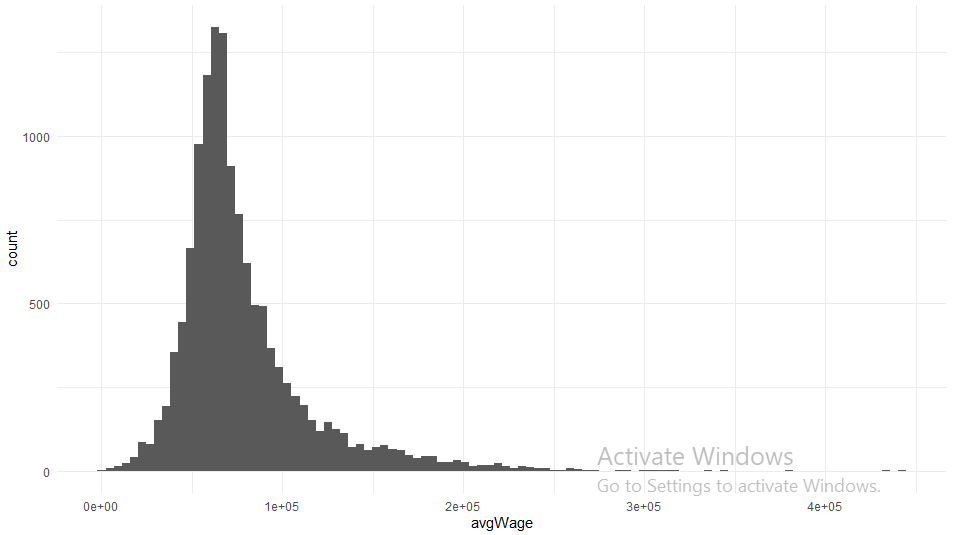

# R Laboratorinis darbas: duomenų vizualizacija

| Variantas | ecoActCode |
|------------- | ------------- |
|5   | 452000 |

### 1. Užduotis

Išvados: Konsultacinės verslo ir kito valdymo veiklos įmonėse vidutinis atlyginimas yra 1529 eurai, didžiausias atlyginimas siekia 22488 eurus.
